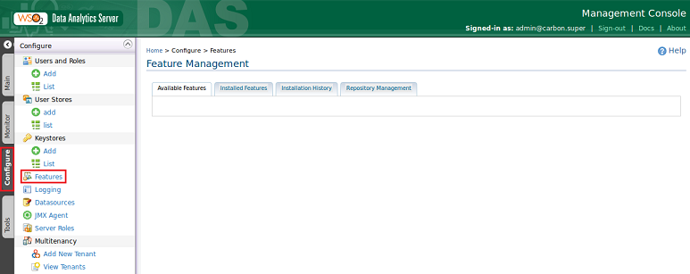
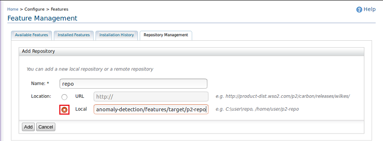
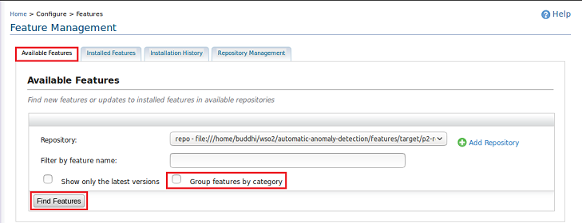
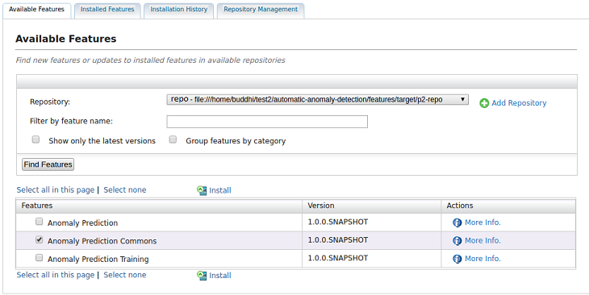
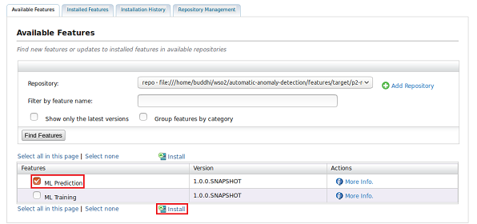
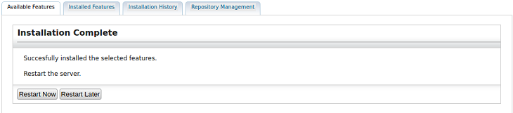

## Introduction
This module contains three features which can be used to collect usage statistics and process them into features from training models and predictions. Moreover, It has several trained models and an ensemble predictor which is capable of generating a one prediction using the all the predictions from the trained models. The dashboard view can be configured to display prediction results for each application/JVM.

1. [Commons-feature](commons-feature) - Deploy all the common das artifacts for the training feature and the prediction feature
  
1. [Training-feature](training-feature) - Collects JVM statistic data and process them into features.
   
2. [Prediction-feature](prediction-feature) - Provides real-time prediction results using trained ML models and WSO2 Machine Learner Siddhi Extension.

## Prerequisites

1. [WSO2 DAS 3.1.0](http://wso2.com/products/data-analytics-server/) or later (Using lower version of DAS may required WSO2 ML and WSO2 CEP products)
2. Java Runtime Environment
3. Apache Maven

## Installation

### 1) Build features

   To build features, first navigate to ```<AAD_Home>/features/``` Then run:
   
   ```
   mvn clean install
   ```
   **NOTE:** After doing this you can see a p2-repo folder inside ```<AAD_HOME>/features/target/```
      
### 2) Install features
   
  1. Extract WSO2 DAS binary distribution to your local file system.
  
  2. [Run WSO2 DAS server](https://docs.wso2.com/display/DAS310/Running+the+Product#RunningtheProduct-Startingtheserver)
  
  3. Log into WSO2 DAS Management Console
  
  4. Go to configurations in the WSO2 DAS server and click on the Features on the left navigation panel.   
  
  
  5. Then click on the Add repository button.
  ![Repository Management]../docs/images/RepositoryManagementScreenshots.png)
  
  6. Give a name to the repository and enter your local p2-repo full path. (Eg:- ```<JMA_HOME>/features/target/p2-repo```)
  
  
  7. Select the repository from Repository List, remove the tick from the Group features by category and click on the Find Features button.
  
  
  
  8. Select the Anomaly Prediction Commons feature.
    
    
  9. Then select the one you want and click install.
    
  
  10. Then restart the server.
  

## Ensemble Predictor
Ensemble prediction can be used to generate a single prediction from all the predictions generated by the individual models.

### Prerequisites
  - Deploy the [Prediction feature](#installation)
  
### Deployment
  1. In the WSO2 DAS Click Main, and then click [Template Manager](https://docs.wso2.com/display/DAS310/Using+Templates)
   under the Manage menu

  2. Select **AnomalyPredictionEnsemblePrediction** template to configure the ensemble predictor.

  3. Configure the template by providing the required parameters
  ![Ensemble Predictor parameters] (../docs/images/AnomalyPredictionEnsemble.png)
  
     - **Voting Threshold** - Number of anomaly predictions from the individual models to decide the system state as anomaly
     - **Anomaly Count** - Number of continues anomaly predictions from the ensemble to decide the system state as anomaly
     - **Interval** - Time gap between two alerts(in seconds)

## Dashboard view
Dashboard view can be used to display the ensemble prediction as well as the individual model predictions for a selected applications

### Prerequisites
  - Deploy the [Prediction feature](#installation)
  - Deploy the [Ensemble Predictor](#ensemble-predictor)
  
### Deployment
  1. In the WSO2 DAS Click Main, and then click [Template Manager](https://docs.wso2.com/display/DAS310/Using+Templates)
   under the Manage menu

  2. Select **AnomalyPredictionResultsDashboard** template to configure the Dashboard view

  3. Configure the template by providing the required parameters
  ![Dashboard view parameter] (../docs/images/AnomalyPredictionResultsDashboard.png)
  
  
  **note** - The Application id of the monitored applications can be obtained by checking the loggers from JMA.
